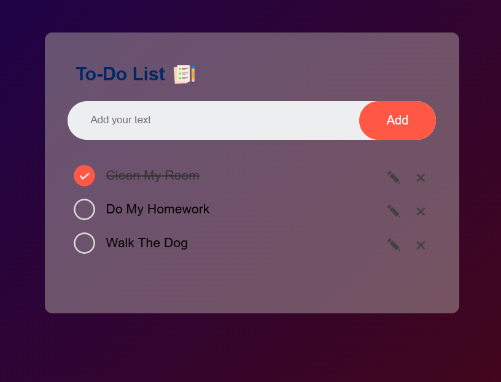

# 📝 Todo List App

A simple and interactive Todo List web application built using pure HTML, CSS, and JavaScript.

The app allows users to manage daily tasks efficiently with automatic saving using Local Storage.

---

## 🚀 Features

- ➕ Add new tasks
- ✏️ Edit tasks
- 🗑️ Delete tasks
- ✅ Mark tasks as completed
- 🔔 Play a sound when completing a task
- 💾 Automatically saves tasks using Local Storage
- 🌙 Dark Mode UI (single theme)

---

## 🛠️ Built With

- HTML5
- CSS3
- Vanilla JavaScript
- Browser Local Storage API

---

## 💡 How It Works

- Tasks are stored in the browser using Local Storage.
- Even after refreshing or closing the browser, tasks remain saved.
- JavaScript dynamically updates the DOM when tasks are added, edited, or removed.

---

## 📸 Screenshot




---

## 📦 How to Run

## 🌍 Live Demo (recommended)

👉 https://to-do-list-bymohammed.netlify.app/


## 🏠 Open Locally

1. Clone the repository:

```bash
git clone https://github.com/yourusername/todo-list.git
```

2. Open the folder.
3. Open `index.html` in your browser.

No installation required 🚀

---

## 🎯 What I Practiced in This Project

- DOM Manipulation
- Event Handling
- Working with Audio in JavaScript
- Using Local Storage
- Managing application state
- Building a clean Dark UI

---

## 📄 License

This project is licensed under the MIT License.